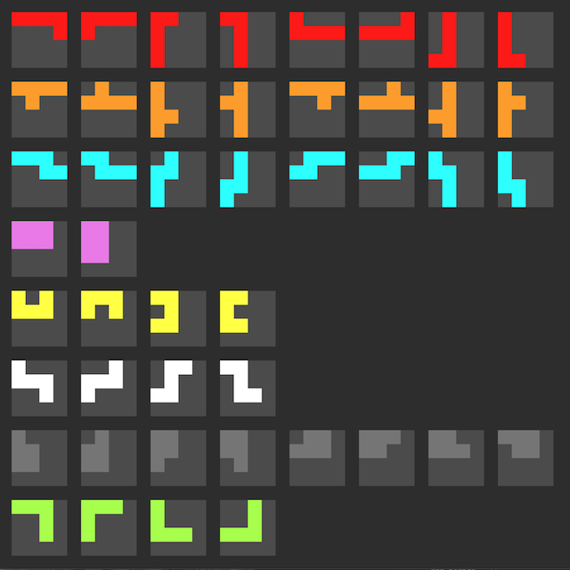

# Calendar Puzzle Solver

The goal of this puzzle is to place all 8 pieces together on the board such that
all squares of the board are covered except a single month and a single day
thereof.  Repeat daily.

I became curious about how one might automatically solve for all dates and,
well, here we are. A simple algorithm finds all solutions (there are 1000s) in
10 minutes or so. One solution per date is here included.

[View solutions here](https://fictorial.github.io/calendar-puzzle-solver/)

## Definitions

### Board

There are 43 board coordinates.

- origin in top-left; row-major ordering
- (0,0) is "Jan"
- (6,0) (right of "Jun") and (6,1) (right of "Dec") are invalid coordinates
- (6,2..6) (right of "31") are invalid coordinates

There are 12x31=372 month-day combinations that we wish to solve.
There are choose(43,2)=903 if all combinations including month-month and day-day are included.

### Pieces

- 8 *logical* pieces.  Every solution contains all logical pieces.
- There are a total of 46 unique *piece forms* across all logical pieces.
- Rotate logical piece by 0/90/180/270 degrees about Z (out of board).
- Each Z-rotated piece form can further be rotated 180 degrees about X as well as Y
  (which amounts to flips vertically and horizontally) to create more piece forms.

## Exhaustive Search Approach

Enumerate all combinations of piece forms. For each piece form, enumerate all
possible placements of the piece form on an empty board. Merge the piece form
boards of each piece form of each piece form combination. Check if valid
solution and record if so. Stop when all solutions have been found or all piece
form combinations have been enumerated.  There are 524288 piece form
combinations, 372 dates to search, and a search space of 13 quintillion 421
quadrillion 772 trillion 800 billion (mostly invalid) options.  A
straightforward solution running in a single thread of a single process will
take about *20000 years* to complete.

    C(8,1) * C(8,1) * C(8,1) * C(2,1) * C(4,1) * C(4,1) * C(8,1) * C(4,1)
    = 524288

    C(20,1) * C(20,1) * C(20,1) * C(20,1) * C(20,1) * C(20,1) * C(20,1) * C(20,1)
    = 20^8 = 25.6e12

    524288 * 25.6e12
    = 13421772800000000000

## Stochastic Approach

Shuffle piece order and piece form order. Place first piece form of each logical
piece on board. If a piece form from each logical piece fits together, check if
it's a valid solution and record it if so.  Repeat until all solutions are
found. This approach takes ~10 minutes on a 2018 Mac Mini so there's no need to
optimize further as the solution is reused.

## Usage

    node .

The file `solutions.json` is then written. A visualization that uses HTML5 canvas is included. The solutions JSON is simply embedded in the `index.html` file.
